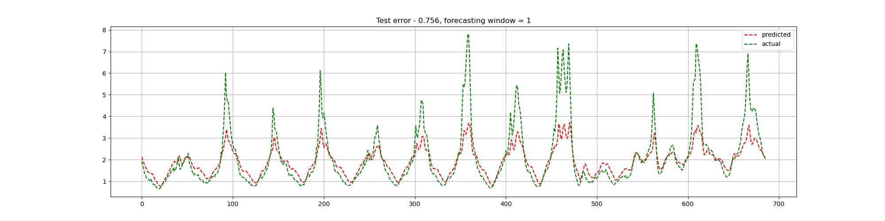
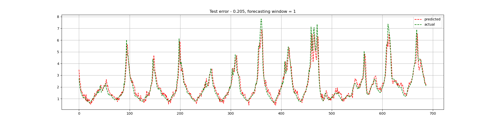
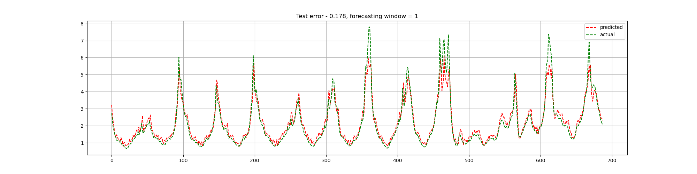
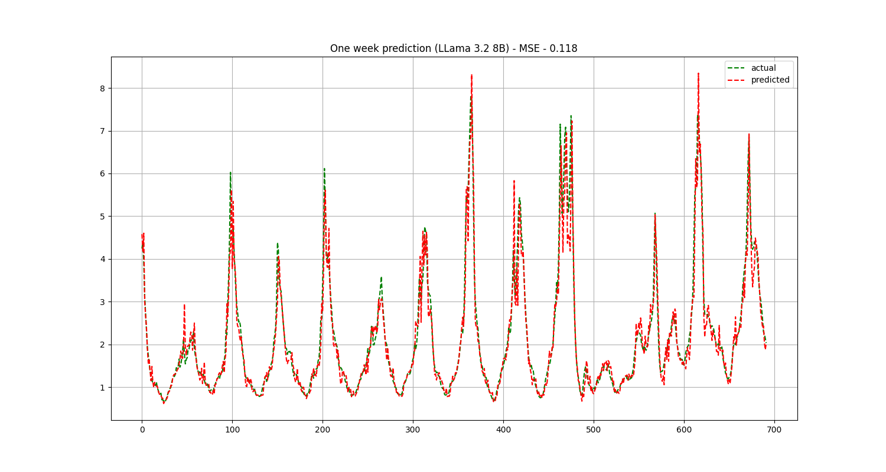

# LLM-Assisted Time Series Forecasting

This project explores how textual data, when aligned with time series, can enhance time series forecasting. Specifically, it focuses on influenza infection prediction in the U.S. by incorporating public health news into various modeling strategies, including LSTM, late fusion methods, and large language models (LLMs).

---

## 🧠 Problem Statement

**Time series modelling enhancement with textual data**  
Traditional time series forecasting models often rely solely on numerical trends. This project addresses the challenge of improving forecasting performance by incorporating temporally-aligned textual context—like weekly news summaries—into the prediction pipeline, enabling richer, more informed forecasts.

---

## 📊 Dataset

The dataset used is from the [Time-MMD repository](https://github.com/AdityaLab/Time-MMD). It contains weekly influenza infection rates in the United States, coupled with news articles published during those weeks. The data is temporally aligned, allowing for joint processing of numerical and textual inputs. The first 50% of the time series is used for training and the remaining 50% for testing.

---

## 📈 Model Comparisons

| Model | Description | MSE |
|-------|-------------|-----|
| Model 1 | LSTM (Only numerical input) | **0.756** |
| Model 2 | LSTM + BERT (Late fusion via concatenation) | **0.205** |
| Model 3 | LSTM + BERT (Late fusion with attention) | **0.178** |
| Model 4 | End-to-End LLM (LLaMA 3B & 8B) | **0.127 (3B)** / **0.118 (8B)** |

---

## 🔧 Model 1: LSTM Baseline

A simple LSTM model predicts the infection percentage for the upcoming week using the last 7 weeks of infection data.

- No textual data used  
- MSE on test set: **0.756**



---

## 🔀 Model 2: Late Fusion (LSTM + BERT)

Here, we enrich the numerical input by fusing LSTM embeddings with text embeddings from BERT. A straightforward concatenation of the two modalities is used before the final prediction layer.

- MSE on test set: **0.205**



---

## 🎯 Model 3: Late Fusion with Attention

To better leverage the rich textual representation, we calculate attention scores between BERT embeddings of all timesteps and the LSTM output. A context vector from the attention mechanism is concatenated with the LSTM embedding for final prediction.

- MSE on test set: **0.178**



---

## 🦙 Model 4: End-to-End Forecasting with LLM

In this model, we use the LLaMA 3B and 8B models in an end-to-end setup. The input consists of text followed by infection rates, tokenized and passed to the model. The LLM learns to forecast the next infection rate directly from the combined data.

- MSE: **0.127 (LLaMA 3B)**, **0.118 (LLaMA 8B)**



---

## 📁 Folder Structure
```
LLM_assisted_timeseries/
├── data/                       # Raw and aligned time series + text data
├── architecture/               # Different model architecture (for LSTM and LSTM + BERT models)
├── models/                     # Model checkpoints and weights and prediction plots for each model
├── train.py                    # For training LSTM and BERT model
├── llama_finetune_health.py    # For finetuning LLama on health dataset
├── llama_eval.py               # Decode the output of LLama 
├── llama_datast_health.ipynb   # Creating prompt for llama
└── README.md                   # Project overview and results
```


## 🧪 Sample Prompt and output of LLaMA

<details>
<summary>Click here to expand</summary>

<pre>
<|start_header_id|>system<|end_header_id|> You are a time series forecasting assistant. Your task is to analyze the infection trends and aggregated public health news over the last several weeks, and accurately predict the influenza infection percentage for the upcoming week.

Use the past infection percentages to identify numerical trends.

Use the weekly news summaries to detect contextual factors.

Only pick relevant news that may influence influenza infection.

Output the prediction in JSON format as: {"target": float, "prediction" : string}

Ensure your prediction is consistent with both the data trends and the news events. Do not output anything other than the JSON. <|eot_id|><|start_header_id|>user<|end_header_id|> Available news of past: [DATE] 1998-01-05
[NEWS] Objective facts about the Pulic Health and FLU situation: The publication types of a research article on AIDS and infectious disease death in HIV patients include Research Support, U.S. Gov't, P.H.S. Aerosol generating procedures are associated with influenza infection Pneumococcal vaccine, influenza vaccine, and hepatitis B vaccine are mentioned in the Federal Register Swine influenza virus infections are considered an important infection source

[DATE] 1997-12-29
[NEWS] Influenza immunization rates among non-elderly persons at high-risk for influenza are far below target levels in the United States. The mysterious bird flu virus, called A H5N1, surfaced in May 1997 and has infected at least 13 and likely as many as 20 people, four of whom have died. Aureus pneumonia occurs almost exclusively in the postviral influenza setting.

[DATE] 1997-12-22
[NEWS] The influenza epidemic took many more lives in the United States during the Great War. In the 18th century, influenza was also referred to as "ye pu-trid or yellow fever".

[DATE] 1997-12-15
[NEWS] The incidence of croup, a common manifestation of respiratory tract infection in children, is associated with human parainfluenza and influenza viruses. Human infection with avian influenza A(H5N1) has been identified in Hong Kong, with many cases being unusually severe. Dual respiratory virus infections, including influenzavirus A, have been identified in children. Influenza vaccine has been shown to be effective in reducing hospital admissions in children. Respiratory syncytial virus and rotavirus infections have a regular pattern, and interaction with other viral infections, such as influenza A virus infection, may play a role.

Available infection data of past
[DATE]1997-12-08, [INFECTION] 1.76632%
[DATE]1997-12-15, [INFECTION] 2.10398%
[DATE]1997-12-22, [INFECTION] 3.13655%
[DATE]1997-12-29, [INFECTION] 3.7185%
[DATE]1997-12-29, [INFECTION] 3.59225%
[DATE]1998-01-05, [INFECTION] 3.68922%

Predict infection on [DATE]1998-01-12
<|eot_id|>
</pre>


```json
{
  "target": 4.60396,
  "prediction": "Based on the provided textual information, I predict that the influenza infection situation in the United States for the upcoming period will likely be severe, with a potential for increased hospitalizations and mortality, particularly among high-risk populations such as the non-elderly with underlying health conditions, due to low immunization rates and the emergence of virulent strains such as avian influenza A(H5N1)."
}
```
</details>


